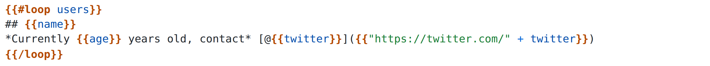
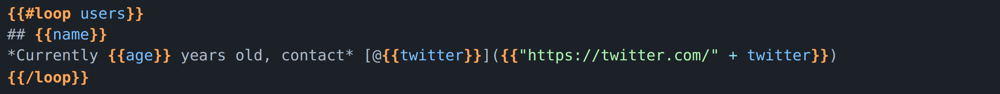

# @bpmn-io/feelers-editor

[](https://github.com/bpmn-io/feelers/actions/workflows/CI.yml)

[CodeMirror 6](https://codemirror.net/) editor component for the [FEELers](https://github.com/bpmn-io/feelers) templating language.




## Usage

```js
import { FeelersEditor } from '@bpmn-io/feelers-editor';

const editor = new FeelersEditor({
  container: document.querySelector('#editor'),
  value: 'Hello {{name}}!',
  onChange: (value) => console.log(value)
});
```

### Configuration

| Option | Type | Description |
|--------|------|-------------|
| `container` | `Element` | DOM node that will contain the editor |
| `value` | `string` | Initial content |
| `onChange` | `Function` | Called when content changes |
| `onKeyDown` | `Function` | Called on keydown events |
| `onLint` | `Function` | Called when linting messages are available |
| `hostLanguage` | `string` | Host language (e.g. `'markdown'`) |
| `hostLanguageParser` | `Parser` | Custom Lezer parser for host language |
| `readOnly` | `boolean` | Makes the editor read-only |
| `darkMode` | `boolean` | Enables dark theme |
| `singleLine` | `boolean` | Limits the editor to a single line |
| `lineWrap` | `boolean` | Enables line wrapping |
| `enableGutters` | `boolean` | Shows line numbers |
| `contentAttributes` | `Record<string, string>` | Extra attributes on the content element |
| `tooltipContainer` | `Element\|string` | Container for tooltips |

## Build and run

Prepare the project by installing all dependencies:

```sh
npm install
```

Then, depending on your use-case you may run any of the following commands:

```sh
# build the library and run all tests
npm run all

# run the development setup
npm run dev

# spin up a simple playground for local development
npm start
```

## Related

* [feelers](https://github.com/bpmn-io/feelers) - FEELers monorepo
* [@bpmn-io/lezer-feelers](https://github.com/bpmn-io/feelers/tree/main/packages/lezer-feelers) - FEELers parser definition
* [@bpmn-io/lang-feelers](https://github.com/bpmn-io/feelers/tree/main/packages/lang-feelers) - FEELers language support for CodeMirror 6
* [@bpmn-io/feelers-lint](https://github.com/bpmn-io/feelers/tree/main/packages/feelers-lint) - FEELers linting support for CodeMirror 6
* [feelers](https://github.com/bpmn-io/feelers/tree/main/packages/feelers) - FEELers interpreter
* [lezer-feel](https://github.com/nikku/lezer-feel) - FEEL language definition for the Lezer parser system

## License

MIT
